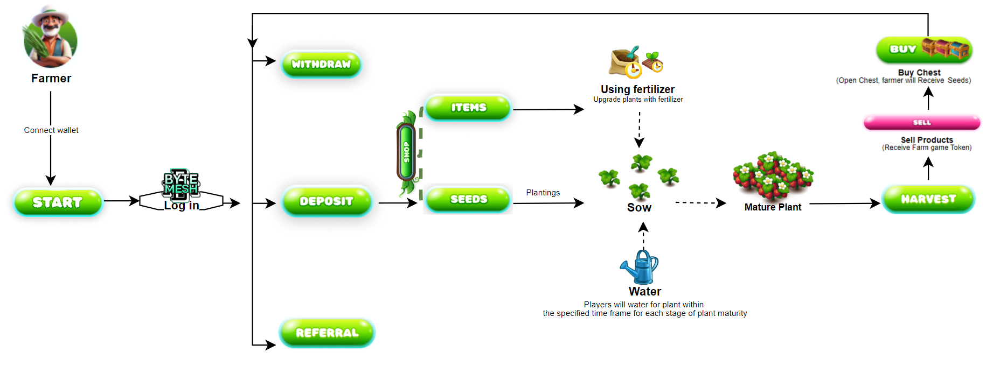

# 🎮 BMH Farm - Game Flow

## **Game Mechanics Farm:**

<figure><figcaption></figcaption></figure>

**1. Play Game:** Register an account by connecting to Metamask wallet

**2. Shop:** Players can buy the seeds on [**`Seed Shop`**](../game-features/basic-features/shop.md)**.** In addition, you can buy other items such as fertilizer, Animal, animal feed, etc.

**3. Sow the seeds, take care and harvest :**

* Each player has 30 plots of land available. The player needs to plant the seeds on the plots of land on the farm.&#x20;
* Each type of tree has a different maturity time and the number of tokens earned is also different When the required number of waterings is reached, the tree will bear fruit and the player can harvest agricultural products.
* If the tree is not taken care of, it will be slow to grow and cannot be harvested on time, significantly affecting the yield.

**4. Token Game**\
  BMH (ByteMesh Game token) is the main token in BMH Farm. It can be used to purchase items in-game.\
 Currently, the FGT (Farm Game token) is only function is to buy a chest allowing them to unlock and earn rewards.

## _**An overall look at the entire game flow.**_

### **Step 1: Set up**

To start playing the game, each "future farmer" of BMH Farm needs to create an account for the game to get started.

1. First thing first, install Metamask wallet and log in to your account.
2. Please visit the link [**`https://farms.bmhchain.org`**](https://farms.bmhchain.org) and connect **`Metamask`**`wallet` to log in to the game.

Each account will be a transaction wallet address, which farmers can use to store items and confirm transactions through this wallet.

### **Step 2:** Deposit

Make a **Deposit** to the game contract address that the user

Deposit your BMH Farm tokens on the BMHgaming website.

### **Step 3:** Cultivation process

Each player has 30 plots of land available. The player needs to plant the seeds on the plots of land on the farm.

**1. Sow the seeds - buy seed**

* Farmer Players can choose from various seeds or seedlings available in the game's store. Click \[[**`Shop`**](../game-features/basic-features/shop.md)] to buy.
* Each plant has detailed information, including estimated maturity time, incidence of special variations, and harvest value.

For example, the "Rose" plant has a maturation time of 4 hours, while the "Jasmine" plant has a maturation time of 5 hours.

**2. Water your seeds**

* Crops need to be tended before they can be harvested. After planting the player needs to manage resources such as water and fertilizer to ensure plants grow strongly.
* If the player does not provide enough water or fertilizer, the plants may become weak and will experience reduced yields.

#### **3. Growth times**

* [**`Growth Times`**](bmhfarm-rules.md#id-1.-the-type-of-seed-affects-how-plants-grow-and-what-they-produce)and yield will vary depending on care conditions and plant type.

#### **4.** Complete the Watering cycle, then Harvest.

* When the tree has matured, Farmers can harvest it to receive the corresponding product [`Warehouse`](../game-features/basic-features/storehouse.md)
* Harvest yield may vary depending on seed quality.
* After harvesting, the plant will be lost and you must buy new seeds to plant.

### Step 4: Warehouse

* When harvesting, you will receive the product. The product is expected to be stored in the player's inventory.
* **Products:** Farmers can use it to sell products from the warehouse, they will receive a corresponding amount of FGT in the game.
* FGT in the game, can use buy chest.

### Step 5: Buy Chest

* A farmer buys a chest and opens it, they will have a chance to receive either seed or even BMH.
* The types of chests can vary in price and rewards, from[ Bronze to Diamond chests](../game-features/basic-features/treasure-chest.md).

### Step 6: Withdraw

The player can only withdraw BMH tokens.

### **Step 7: Claim Reward**

Players can refer friends to play the game to reach the VIP level and get extra huge bonus rewards from the in-game [`referral` ](../referral-system/what-is-the-referral-system.md)system.
