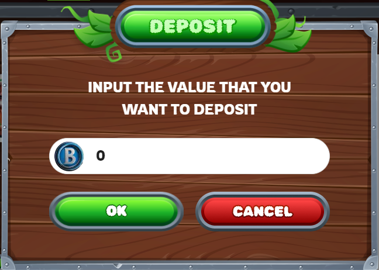

---
layout:
  title:
    visible: true
  description:
    visible: false
  tableOfContents:
    visible: true
  outline:
    visible: true
  pagination:
    visible: true
---

# 🪙 Deposit

Go to menu User => Click \[Deposit]

<figure><figcaption></figcaption></figure>

Input the value that you want to deposit. Click \[ok].

<figure><figcaption></figcaption></figure>

Once completed, the deposit amount will be added to the game wallet

<figure><figcaption></figcaption></figure>

