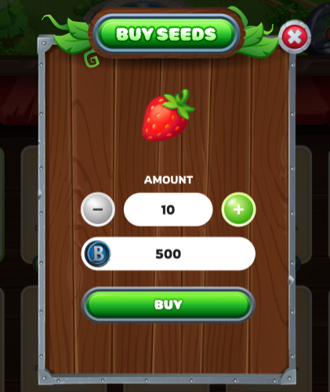
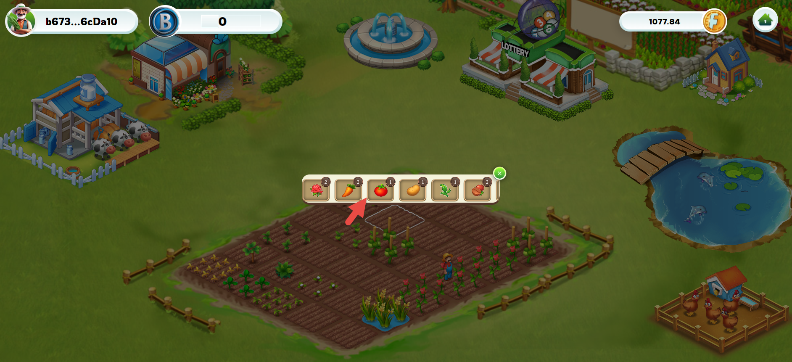
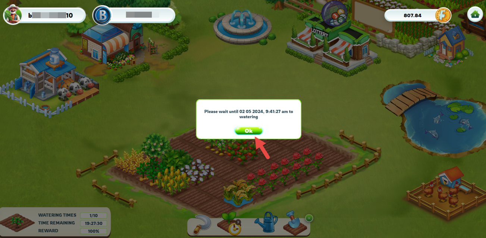
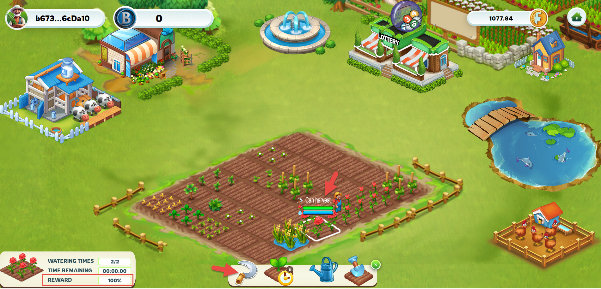

---
layout:
  title:
    visible: true
  description:
    visible: false
  tableOfContents:
    visible: true
  outline:
    visible: true
  pagination:
    visible: true
---

# 🪴 Farm

## 1. Sow seeds

Each player will be provided with 30 empty land plots for planting. After purchasing seeds from the [`shop`](shop.md), players can start planting on these plots.

<figure><figcaption>
Buy Seeds
</figcaption></figure>

**To start planting:**

* The player needs to click on an empty plot of land, and a table of available seeds in the warehouse will be displayed

<figure><figcaption></figcaption></figure>

* Continue, to choose the type of seed you want to plant. Each type of plant may require different growing conditions. So the planting was successful.

<mark style="color:red;">**Attention:**</mark> If the player chooses to destroy a planted tree, it will be permanently removed from their inventory or farm. Consequently, the player will not receive any seeds or refunds for the destroyed tree.

## **2. Taking care of plants**

* Each plant will go through three stages of maturity before it can be harvested.
* Players will need to cultivate and water the plants during each of these stages to ensure the plants grow as well as possible. After germination, the plant has 100 HP.

**Cultivation and watering:**

<figure><figcaption></figcaption></figure>

* The time between cultivation and watering can be determined based on the type of plant and growing conditions.

<figure><figcaption>
Watering of plant
</figcaption></figure>

**When using fertilizer:**&#x20;

* You can use fertilizer to increase the plant's HP.
* One application of fertilizer will plant growth by 3 hours.

<mark style="color:red;">**Note that:**</mark> Watering is free, but fertilisers must be purchased from the [`store`](shop.md).

## 3. Harvest

<figure><figcaption>
Harvesting
</figcaption></figure>

* Once the plant has matured, farmers can harvest to receive the corresponding products.
* &#x20;The percentage of HP (%) of each tree corresponds to % of harvested products. Always ensure the plant's HP is high to maximize crop yield.
* After harvesting, the plant will wither, and farmers will need to purchase new seeds for replanting. The planting process is a continuous cycle, and farmers will have to prepare new seeds after each harvest to continue the process of caring for and planting new crops.

