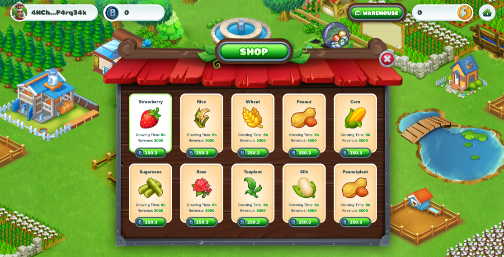
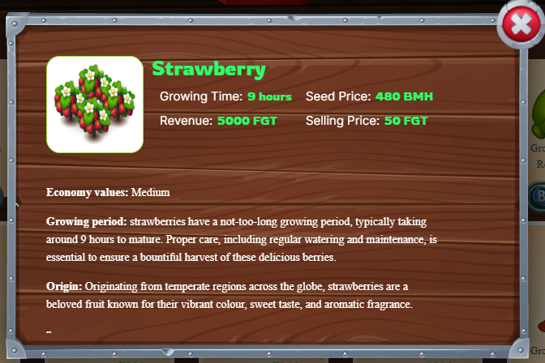

---
layout:
  title:
    visible: true
  description:
    visible: false
  tableOfContents:
    visible: true
  outline:
    visible: true
  pagination:
    visible: true
---

# 🛒 Shop

The Shop is where player can purchase seeds and access detailed information about each type of seed available, as well as other in-game items.

* Users can access the Shop from the main menu of the game.

### 1. Seeds 

<figure><figcaption></figcaption></figure>

<figure><figcaption></figcaption></figure>

* In the Seeds section, Players can buy many types of seeds
* Each seed will have a different price, growth time, and yield and a brief description of its characteristics and benefits.
* Users can select the seeds they want to buy and proceed to checkout.

### 2. Animals (Coming Soon) 

* Shop animals can be part of the game's business system, allowing players to purchase animals using in-game currency.
* Shop Animals can provide players with animals or pets to raise in the game.

### 3. Items 

Shop items provide players with items that can be used in the game, including fertilizer, animal food and more.

<figure><figcaption></figcaption></figure>

**Fertilizer** is used to stimulate the growth and development of crops.&#x20;

