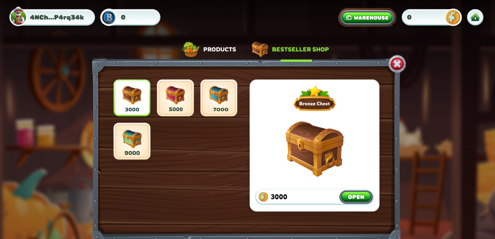
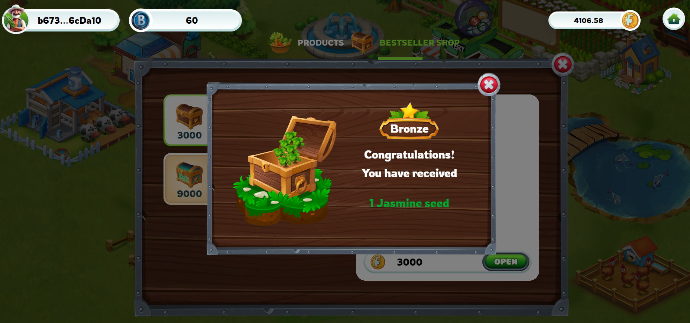
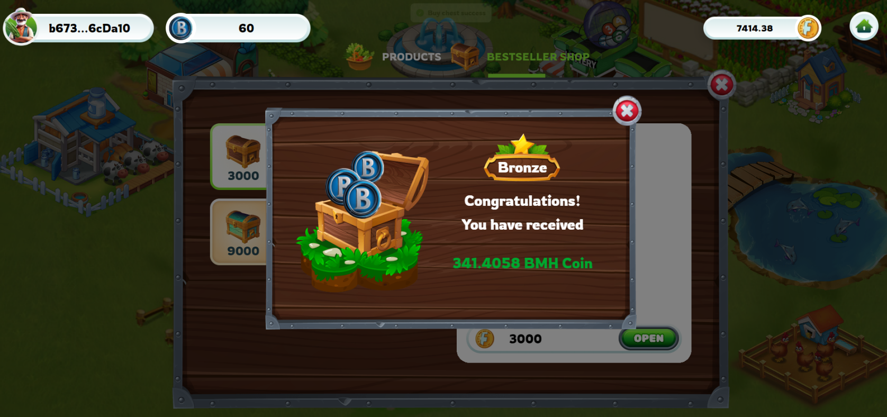

---
layout:
  title:
    visible: true
  description:
    visible: false
  tableOfContents:
    visible: true
  outline:
    visible: true
  pagination:
    visible: true
---

# 🎁 Treasure Chest

### 1. Products 

**Harvesting and Products:**

* Players will obtain products from planting in the game when harvesting.
* These products are expected to be stored in the player's inventory.

**Products and FGT:**

* Farmers can utilize the products to sell from their warehouses.
* They will receive a corresponding amount of FGT (in-game currency) upon selling the products.
* FGT can then be used to purchase chests within the game.

 Bonus FGT when reaching VIP level

<figure><figcaption></figcaption></figure>

2\. Bestseller Shop

After completing the sale of products to receive FGT, players will use FGT to open treasure chests, each chest will provide a different reward. Users will receive a random reward

* There are 4 Treasure Chests in total. IncIncluding Bronze - Silver - Golden- Diamond

<figure><figcaption></figcaption></figure>

**Open a chest**

The rewards for opening chests can vary widely, depending on the chest packs. Rewards may include seeds and tokens.

* Bronze Chest - 2700 FGT: Seeds ( Rose, Jasmine, Carrot, Tomato, Potato), BMH (Tokens 310-550)
* Silver Chest - 4500 FGT: Seeds (Strawberry, Rice, Wheat, Peanut, Corn), BMH (Tokens 540-790)
* Golden Chest - 6300 FGT: Seeds (Cotton, Sugarcane, Silk, Teaplant, Pepper), BMH (Tokens 780-990)
* Diamond Chest- 8100 FGT: ( Rubber, Coffee, Cacao, Pinetree), BMH (Tokens 980-1150)

#### Receive rewards

* Receive Seeds 🌱

You will receive seeds as a rewards. The seed will be directly added to your warehouse.

<figure><figcaption></figcaption></figure>

* Receive tokens as rewards 🌟

You will receive tokens as rewards.

<figure><figcaption></figcaption></figure>

To claim the tokens, you need to click on the 'Claim' button. Once claimed, the tokens will be directly added to your wallet.

<figure><figcaption></figcaption></figure>
