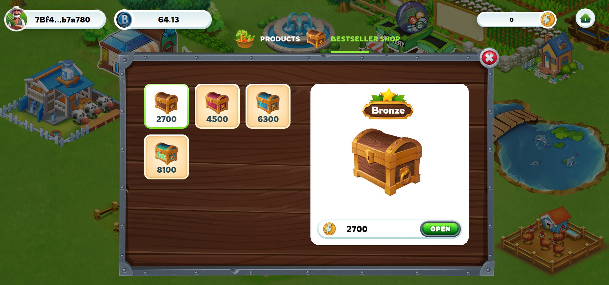

---
layout:
  title:
    visible: true
  description:
    visible: false
  tableOfContents:
    visible: true
  outline:
    visible: true
  pagination:
    visible: true
---

# 🎁 Treasure Chest

### 1. Products 

**Harvesting and Products:**

* Players will obtain products from planting in the game when harvesting.
* These products are expected to be stored in the player's inventory.

**Products and FGT:**

* Farmers can utilize the products to sell from their warehouses.
* They will receive a corresponding amount of FGT (in-game currency) upon selling the products.
* FGT can then be used to purchase chests within the game.

<figure><figcaption>
Sell ​​products to receive FGT
</figcaption></figure>

### 2. Bestseller Shop 

After completing the sale of products to receive FGT, players will use FGT to open treasure chests, each chest will provide a different reward. Users will receive a random reward

* There are 4 Treasure Chests in total. IncIncluding Bronze - Silver - Golden- Diamond

<figure><figcaption></figcaption></figure>

For example, if you open a chest of containing

* &#x20;**Bronze Chest -  3000 FGT:**  Seeds ( Rose 40% , Jasmine 25% carrot 10% , Tomato 10%, Potato  10%). BMH tokens (295-350) chance 5%.
* **Silver Chest - 5000 FGT:** Seeds  ( Strawberry 40%, Rice 25% , Wheat 10%, Peanut 10%,  Corn 10%). BMH tokens (515-560) chance 5%.
* **Golden Chest - 7000 FGT**: Seeds  (Cotton 40% , Sugarcane 25%, Silk 10%, Teaplant 10%, Pepper 10% ). BMH tokens (750-810) chance 5%.
* **Diamond Chest- 9000 FGT:** ( Rubber 40%, Coffee 35% Cacao 10% Pinetree 10% ) BMH tokens (950-1050 ) chance 5%.

<figure><figcaption>
Rewards for opening chests
</figcaption></figure>

