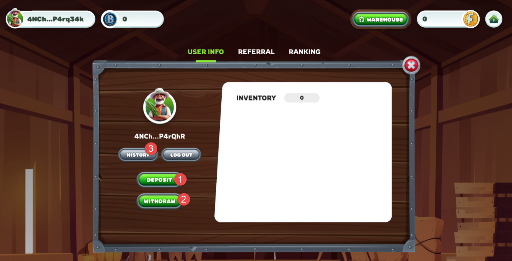
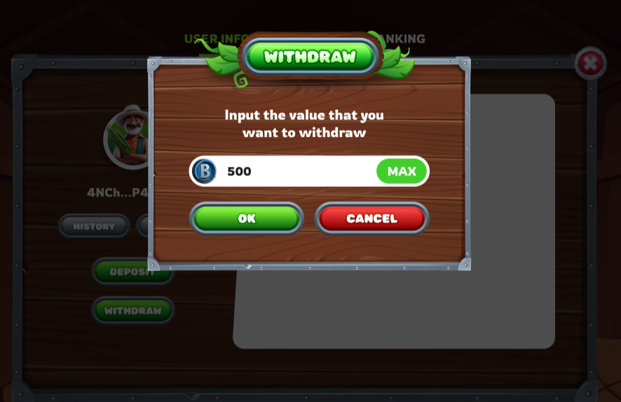

---
layout:
  title:
    visible: true
  description:
    visible: false
  tableOfContents:
    visible: true
  outline:
    visible: true
  pagination:
    visible: true
---

# 🎏 Withdraw (Coming Soon)

Go to menu User => click \[Withdraw]

<figure><figcaption></figcaption></figure>

Enter the amount you want to withdraw, Continue to click \[ok]

<figure><figcaption></figcaption></figure>

Immediately, the withdrawal amount will be transferred directly to your wallet.

<figure><figcaption></figcaption></figure>

