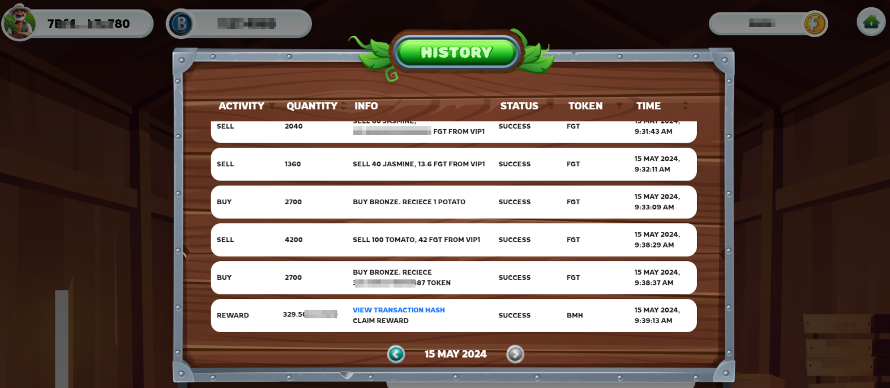

# 🪵 House

### <mark style="color:blue;">Receive Rewards</mark>

For Open Chest, the reward will be received in tokens, and the reward for Referral reward be given in the form of tokens.

* To receive tokens, users must perform a "<mark style="color:green;">**Claim**</mark>"  (click the Claim button ) operation to record their transactions.
* &#x20;This procedure ensures that every received amount is recorded and stored on the blockchain.&#x20;
* The token amount will automatically be added to the user's account balance when the claimed operation is performed successfully.

<figure><figcaption></figcaption></figure>

### <mark style="color:blue;">History</mark>

The transaction activity log records all buy/sell, and reward activities performed by users.

<figure><figcaption></figcaption></figure>

