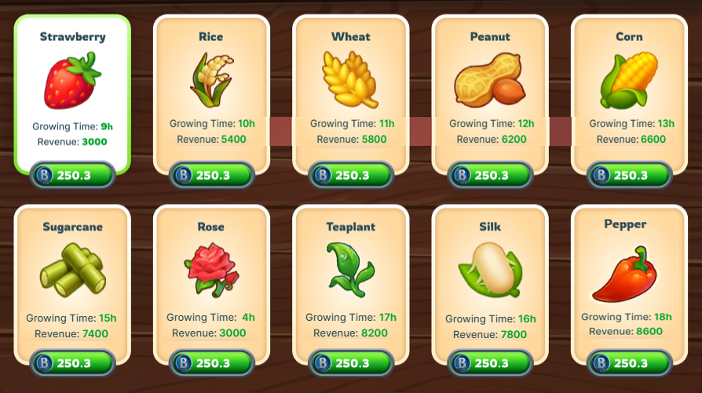

# 🌱 Seeds

Seed is one of the most important items in the farming game. They represent the resources needed to begin the process of growing and growing crops.

Each type of seed may have its characteristics, such as growing time, yield, and commercial value.

<figure><figcaption>
seeds table example
</figcaption></figure>

